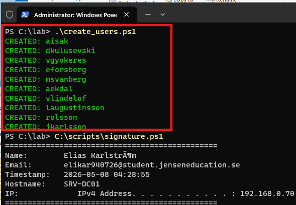
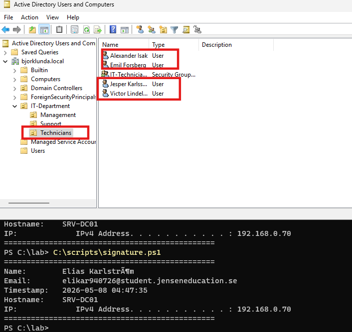
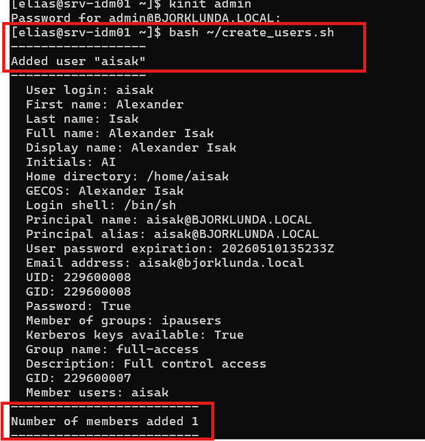
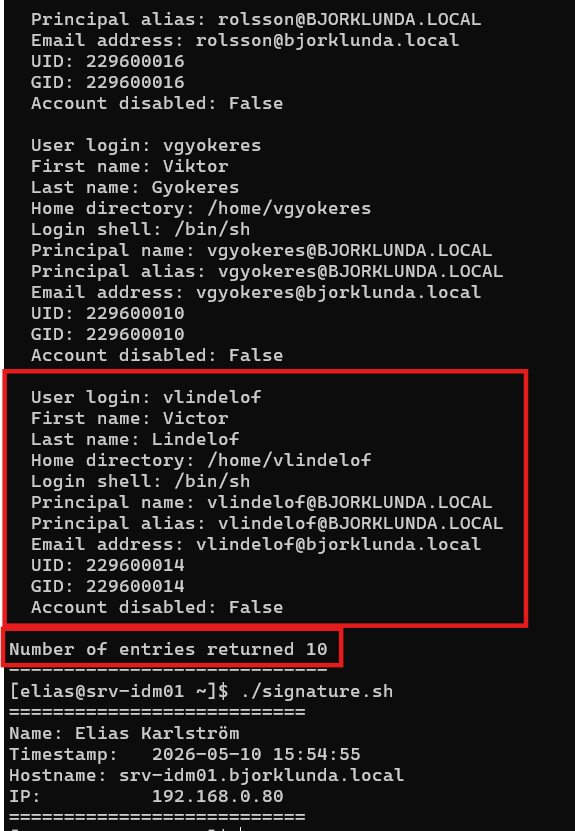
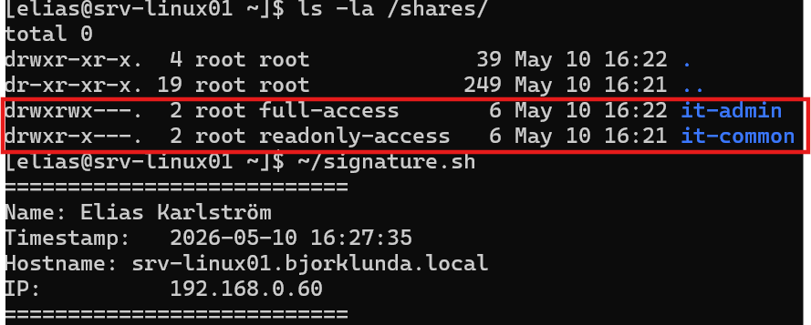
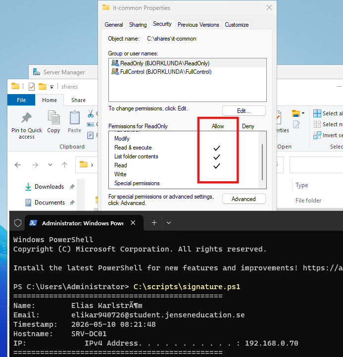
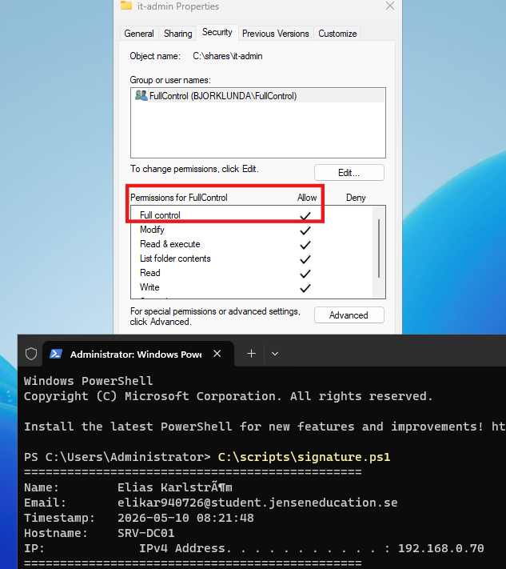
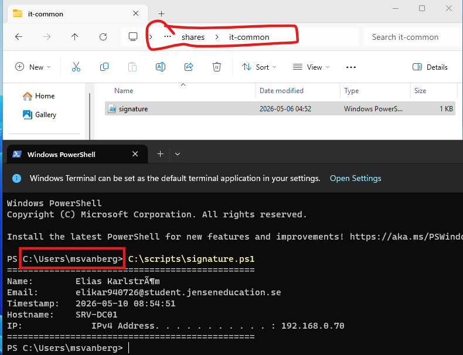
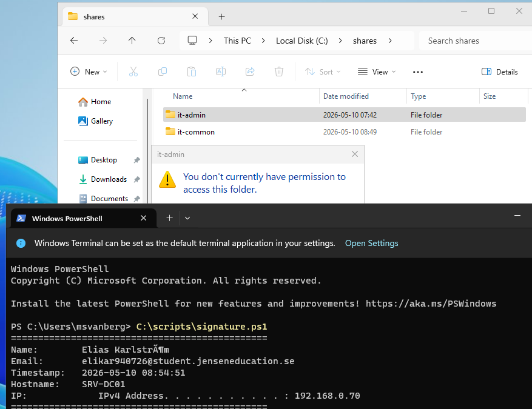

# Logbook — Björklunda kommun Del 1 
**Namn:** Elias Karlström 
**E-post:** elikar940726@student.jenseneducation.se 
**Inlämning:** Del 1 — Grundmiljön 

--- 
## Arbetslogg

### 2026-05-04 
**Arbetat med: Del 1 Signaturskript och satt upp mitt repo** 

**Vad jag gjorde: Jag skapade mitt repo lokalt på min dator och gjorde signaturskript i vsc** 

**Problem och lösningar: Jag hade ingra problem under den sektionen** 

**Beslut jag fattade: Jag comittar mitt repo i vsc istället för terminalen.** 

**Källor jag använde:** 

### 2026-05-04 
**Arbetat med: Del 2: Planering** 

**Vad jag gjorde: Planerat partitionsstorlekarna för mina olika Linux servrar** 

**Problem och lösningar: Inga problem här eftersom jag endast planerat, visade sig dock vara problem i nästa del** 

**Beslut jag fattade: Storlek på mina servrar, storlek på VM maskiner. Resurser som servrarna ska ha.** 

**Källor jag använde: AI har använt redhads rekommendationer för minumum storlek utav de olika partitionerna** 

### 2026-05-05 
**Arbetat med:Del 3: Planering** 

**Vad jag gjorde: Installerade min srv-linux01 och satte statisk ip adress och hostname** 

**Problem och lösningar: RHEL vägrade installera för att den kunde inte räkna ut utrymmet på min hårddisk, efter många om och men så visade det sig att jag behövde en partition som heter /boot/efi på 600 mib**

**Beslut jag fattade: La till en ny partition /boot/efi** 

**Källor jag använde:** 

### 2026-05-07 
**Arbetat med: Del 4: Windows Server och Active Directory** 

**Vad jag gjorde: Installerade DC01 med Active Directory, installerade idm01, instellare IdM på bägge linux datorer** 

**Problem och lösningar: DC01 gjorde en VMWare easy installation och tillät mig inte att göra några val under installationen. Jag var tvungen att göra en manuell installation via VMware. Jag kunde inte installera IdM på min idm01. Det stod att det var ett error med GPG key. Jag var tvungen att ta bort min 10.1 RHEL server och installera RHEL 9.7. Samma problem uppstod ävden på linux01. Där var jag också tvungen att ta bort servern och installera den igen.** 

**Beslut jag fattade: Installerade om mina linux servrar med RHEL 9.7, ändrade i users.csv** 

**Källor jag använde: https://docs.redhat.com/en/documentation/red_hat_enterprise_linux/10/html/considerations_in_adopting_rhel_10/identity-management** 

### 2026-05-10 
**Arbetat med: Del 5: Kontohantering med script** 

**Vad jag gjorde: Skapade konton i Active Directory och IDM med script** 

**Problem och lösningar: Fick problem när jag skulle köra mina script på dc01 (där man skapar användarna och lägger dom i rätt OU), det fungerade inte för att skriptet i instruktionerna var skrivna med andra gruppnamn än dom som det stod att vi skulle skapa enligt instruktioerna.** 

**Beslut jag fattade: Ändrade namn på grupperna i users.csv så att de matchade mina redan skapade grupper i AD** 
**Källor jag använde:** 

### 2026-05-10 
**Arbetat med: Del 6: Delade mappar och rättigheter** 

**Vad jag gjorde: Skapade mappar på linux01 och DC01 som jag gav  rätt rättigheter på** 

**Problem och lösningar: Jag kunde inte logga in med något av de konton jag skapat på dc01. Jag var tvungen att lägga till att mina användare i fullcontrol och readonly kunde logga in lokalt.** 

**Beslut jag fattade: Vilka rättigheter som jag skulle ta bort och hur jag skulle göra så att mina användare kunde logga in lokalt så jag kunde testa åtkomst till mapparna. Jag var tvungen att lägga in åtkomst för administratör på mapparna igen för att kunna dela ut dom** 

**Källor jag använde:** 

### 0000-00-00 
**Arbetat med:** 

**Vad jag gjorde:** 

**Problem och lösningar:** 

**Beslut jag fattade:** 

**Källor jag använde:**

### 0000-00-00 
**Arbetat med:** 

**Vad jag gjorde:** 

**Problem och lösningar:** 

**Beslut jag fattade:** 

**Källor jag använde:**

### 0000-00-00 
**Arbetat med:** 

**Vad jag gjorde:** 

**Problem och lösningar:** 

**Beslut jag fattade:** 

**Källor jag använde:**

### 0000-00-00 
**Arbetat med:** 

**Vad jag gjorde:** 

**Problem och lösningar:** 

**Beslut jag fattade:** 

**Källor jag använde:**

---

# Del 1 — Förberedelse och sätta upp repo -

Jag har skapat ett red hat developer konto och laddat ned senaste ISOn

Git är installerat och konfigurerat
- Namn: Elias Karlström
- Mail: elikar940726@student.jenseneducation.se

Repo initierat och mappstruktur skapad så som instruktionerna.

Skapat .sh och .ps1 signatur.

Skapat några commits enligt instruktionerna.

# Del 2 — Planering -

Redhat säger att /boot ska ligga på en egen partition som har minst 1 GB utrymme.

XFS är RHEL:s standardfilsystem, optimerat för stora filsystem och hög prestanda.

ext4 är äldre, stabilt och enklare men har lägre maxgränser för filstorlek och volym.

RHEL IdM är Red Hats system för central hantering av Linux‑användare, autentisering, grupper, SSH‑nycklar och policies. Det bygger på FreeIPA. (Så deras version av Active Directory)

Något jag inte förstod? - Jag tycker att allt det känns som att det är väldigt mycket information och lite otydligt.

Källa: https://access.redhat.com/documentation/en-us/red_hat_enterprise_linux/

srv-linux01 - Partitionsplan
Mount point   Minimum size   Filesystem   Motivering
/boot         1 GB           xfs          Standard, minsta rekommenderade storlek
/             20 GB          xfs          Räcker för system, loggar och installerade paket
/home         10 GB          xfs          Minimikrav, lagrar användarfiler
swap          2 GB           swap         Minimikrav

srv-idm01 - Partitionsplan
Mount point   Minumum size   Filesystem   Motivering
/boot         1 GB           xfs          Standard
/             30 GB          xfs          IdM installerar fler tjänster och databaser
/home         20 GB          xfs          Mer utrymme för användardata och certifikat
swap          2 GB           swap         Minimikrav

# Del 3 — Linux-serverinstallation -

Del 3.2
Jag har installerat srv-linux01. Jag var tvungen att lägga till en /boot/efi på 600 mib för att det skulle fungera. Innan dess fick jag problem med min installation, det ståd att den inte kunde kontrollera utrymme, jag testade det mesta innan jag lyckades ta reda på vad felet var.
Jag har gjort screenshots och lagt i screenshot mappen.

Del 3.3
"lsblk" visar min virtuella hårddisk och alla partitioner samt hur de hänger ihop.

"df -h" visar att mina filsystem är korrekt monterade och hur mycket diskutrymme som används och är ledigt på mina partitioner.

"ip addr show" visar nätverkskonfiguration, exempelvis IP address och nätverkskort.

"hostnamectl" visar vad datorn heter, information om operativsystem och allmän information om datorn som inte riktigt syns så bra för mig då det är en VM och inte en riktig fysisk dator.

Del 3.4

Del 3.4.3.
Tre tjänster och varför de behövs:
"sshd.service" gör att man kan fjärransluta till en server.

"NetworkManager.service" hanterar nätverksanslutningar, utan den fungerar inte internet eller lan.

"firewalld.service" hanterar brandväggen och öppnar och stänger portar för inkommande ut och utgående trafik.

Vilken port lyssnar SSH på och vad används den till?
- Port 22 och används till att fjärransluta.

Om man stänger av en kritiskt tjänst så kan systemet bli ostabilt eller osäkert, beroende på vilken tjänst man stänger av.

Man kan ta reda på om en tjänst är systemkritisk genom att skriva systemctl status <tjänst>

Del 3.5.1

 
 # Felsökning
 del 3.6.1

Min output visar att SSH är active (running) och enabled
hade den inte vart igång hade stått stått active (dead) eller inactive (stopped)
För att starta igen hade jag skrivit sudo systemctl start sshd

del 3.6.2

min output visar att mitt datornamn är satt korrekt, detta är vad servern identifierar sig som i nätverket.
Om det skulle stå ett annat namn än vad jag satt så hade det varit fel.
För att byta hostname skriver man sudo hostnamectl set-hostname srv-linux01.bjorklunda.local

Del 3.6.3

Detta visar att min statiska IP adress som jag har satt på mitt primära nätverkskort är rätt och att den är på samma nätverk som min värddator, då min värddator har samma nätverksadress (det står inte där men jag vet det då jag har kollat det i terminalen med ipconfig)
Hade nätverksadressen varit annorlunda hade den varit på fel nätverk.

Min ip adress var från början fel och då ändrade jag den med "sudo nano /etc/NetworkManager/system-connections/ens160.nmconnection
sudo systemctl restart NetworkManager"

Del 3.6.4

Alla partitioner som jag skapade själv matchar min plan och är på rätt plats med rätt storlek.
Om exempelvis /home had saknats eller om en storlek inte var det jag satte den till, så hade det varit fel.
Man kan korrigera detta här /etc/fstab och sedan ladda om konfigurationen med sudo mount -a

del 3.6.5

Eftersom jag inte har installerat idm01 och dc01 så kommer ping inte att fungera, vilket framgår i min screenshot. Jag kan dock pinga min värddator.

Nätverksanslutningen hade varit bruten mm ping visar “Destination Host Unreachable”, 100% packet loss även om ip-adresserna är  i samma nät.

Jag hade kontrollerat brandväggar, att alla ip adresser är korrekta och att alla servrar är igång.

# Del 4 — Windows Server och Active Directory -

Del 4.1.1.

(jag har lyckats pinga till dc01 som har ip 192.168.0.70)

Del 4.1.2

Lyckad ping från DC01 till serv-linux01

Del 4.2

Signatur

Del 4.3.1

AD DC aktivt

Del 4.3.2 frågor
Vad är en skog(forest) i AD?
En forest är den översta nivån i active directory där alla domäner ingår.

Vad är skillnaden mellan en domän och en OU?
En domän är hela "byggnaden" där alla användare, datorer och regler finns.
OU är där en mapp inne i domänen där man sorterar exempelvis användare och datorer

Vad används DSRM lösenordet till?
Det används när man startar en domänkontrollant i reparationsläge. Det är enda sättet att komma åt AD om databasen går sönder.

Del 4.4.1

Del 4.5

Jag har även skapat grupper direkt under mina tre OU, exempelvis IT-Technicians

Del 4.6.1

del 4.7.1

Jag var tvungen att ta bort min VM för att serverdelarna fungerade inte med rhel 10.1
Laddade ner rhel 9.7

Del 4.7.2
1. Vad är RHEL IdM och vad används det till?
RHEL IdM är Red Hats system för central hantering av Linux‑användare, grupper och autentisering. Liknande Active Directory på Windows

2. Skillnaden mellan RHEL IdM och Active Directory i din miljö
IdM hanterar Linux‑konton.
AD hanterar Windows‑konton.

3. Vilka tjänster startar IdM automatiskt och vad gör de?
LDAP – lagrar användare och grupper
Kerberos – sköter inloggning/SSO
Dogtag CA – hanterar certifikat
DNS – domänens DNS
HTTPD – webgränssnittet för IdM

Del 4.8.1

Del 4.8.2

Del 4.9.1

Del 4.9.2 – Svar på frågor
1. Vad innebär det att srv-linux01 är ansluten till IdM?  
Linux01 använder nu centrala IdM‑konton för autentisering istället för lokala konton. På samma sätt som Active Directory fungerar i Windows miljö.

2. Vad är skillnaden mellan att logga in med ett lokalt konto och ett IdM‑konto?  
Lokala konton finns bara loktalt på ens fysiska dator, medan IdM‑konton lagras centralt och fungerar på alla anslutna Linux‑servrar.

3. Vad händer om srv-idm01 slutar fungera?  
Användare som loggat in tidigare kan fortfarande logga in tack vare cache, men nya inloggningar fungerar inte.

# Del 5 — Kontohantering med script -
Del 5.2.1

- Laddar in AD modulen så att powershell kan köra active directory kommandon.
Import-Module ActiveDirectory

- Den här raden laddar in alla användare från CSV‑filen så att scriptet kan jobba med dem en i taget.
$users = Import-Csv -Path "C:\lab\data\users.csv" -Encoding UTF8

foreach ($user in $users) {

- Om en användare redan finns med samma namn så skapar den inte en dublett, skriver istället ut att användaren redan finns.
    if (Get-ADUser -Filter "SamAccountName -eq '$($user.Username)'" -ErrorAction SilentlyContinue) {
        Write-Host "SKIPPED: $($user.Username) already exists" -ForegroundColor Yellow
        continue
    }

- Placerar varje användare i rätt OU baserat på deras avdelning.
    $ouPath = "OU=$($user.Department),OU=IT-Department,DC=bjorklunda,DC=local"

- Skapar ett nytt AD‑konto med rätt namn, användarnamn, lösenord och placering i OU‑strukturen, baserat på informationen i CSV‑filen.
    New-ADUser `
        -Name "$($user.FirstName) $($user.LastName)" `
        -GivenName $user.FirstName `
        -Surname $user.LastName `
        -SamAccountName $user.Username `
        -UserPrincipalName "$($user.Username)@bjorklunda.local" `
        -Path $ouPath `
        -Enabled $true `
        -AccountPassword (ConvertTo-SecureString "Welcome2024!" -AsPlainText -Force)

- Lägger till användaren i rätt säkerhetsgrupp
    Add-ADGroupMember -Identity $user.ADGroup -Members $user.Username

- Skriver ut att användaren har skapats
    Write-Host "CREATED: $($user.Username)" -ForegroundColor Green
}

Del 5.2.2

För att det här skulle fungera så var jag tvungen att ändra till rätt gruppnamn i users.csv
Vi ombads tidigare att döpa grupperna till samma namn som deras OU, men i users.csv så står det GRP_(gruppnamn), detta gör att scriptet försöker lägga till användarna i grupper som inte finns.

Del 5.2.3

Användarna hamnar i rätt plats i OU strukturen.

Del 5.3.1

# Pekar på vart user.csv ligger
CSV_FILE="$HOME/users.csv"

# Kollar att filen finns där den ska finnas, annars skriver den ut att den inte hittar
if [ ! -f "$CSV_FILE" ]; then
    echo "ERROR: CSV file not found at $CSV_FILE"
    exit 1
fi

# Hoppar över rubrikraden i CSV‑filen och läser varje rad en i taget.
tail -n +2 "$CSV_FILE" | while IFS=',' read -r \
    first last username dept adgroup idmgroup; do

# Kontrollerar om användaren redan finns i IdM, och om kontot finns så hoppar scriptet över användaren och fortsätter till nästa rad.
    if ipa user-find --login="$username" &>/dev/null; then
        echo "SKIPPED: $username already exists"
        continue
    fi

# Skapar ett nytt IdM‑konto med användarnamn, förnamn, efternamn och ett standardlösenord
    ipa user-add "$username" \
        --first="$first" \
        --last="$last" \
        --password <<< "Password123"

# Lägger till användaren i rätt idm grupp enligt users.csv
    ipa group-add-member "$idmgroup" --users="$username"

# Skriver ut en text att användaren är skapad och tillagd i sin grupp
    echo "CREATED: $username added to group $idmgroup"

Del 5.3.2

Jag skrev mitt signaturescript efter användarna var skapade, så det syns på nästa skärmbild

Del 5.3.3

Mina 10 användare är skapade

Del 5.3.4

Varför skapar vi konton i både AD och IdM istället för bara ett system? 
- För att Windows‑miljön använder Active Directory för autentisering, medan Linux‑servrar använder IdM. Båda systemen behövs för att användare ska kunna logga in och få rätt behörigheter i både Windows och Linux.

Vad är fördelen med att läsa användare från en CSV-fil istället för att skapa dem manuellt? 
- Att använda csv filen gör att man kan skapa många användare snabbt på en gång.

Vad händer om scriptet körs två gånger och varför är det viktigt att hantera det? 
- Då försöker den skapa samma användare två gånger och lägga till dom i samma grupp två gånger. Därför är det viktigt att lägga till i scriptet att kontrollera ifall användaren redan finns.

# Del 6 — Delade mappar och rättigheter -

Del 6.1.1

Mapparna är skapade med rätt rättigheter. Fungerade inte först för att min srv-idm01 inte var igång.

Del 6.1.2
Första siffran av CHMOD kommandot är ägarens rättigheter, andra siffran är gruppens rättigheter, sista siffran är alla andras rättigheter.

750 = Ägaren har läs skriv och kör, gruppen har läs och kör, alla andra har ingen åtkomst
770 = Ägaren och gruppen har läs skriv och kör, alla andra har ingen åtkomst.

Del 6.2.1
Jag tog bort:
Users
Authenticated Users
Domain Users
Everyone
CREATOR OWNER
Administrators
Jag tog bort dessa eftersom uppgiften kräver att endast grupperna ReadOnly och FullControl ska ha åtkomst till mapparna, annars skulle annars fler användare åtkomst än vad som är tillåtet.

Del 6.2.2

Del 6.2.3

Del 6.4.1

Tillåten åtkomst från användare med readonly

Del 6.4.2

Nekad åtkomst från användare med readonly

Del 6.4.3
Vad är skillnaden mellan NTFS-rättigheter och delningsrättigheter (share permissions)? 
- NTFS styr vad du får göra med själva filerna, oavsett hur du är ansluten.
- Delningsrättigheter styr vad du får göra om du är ansluten via nätverket.

Vilka rättigheter gäller när en användare ansluter till en delad mapp via nätverket? 
- Den mest begränsande rättigheten mellan delnings och NTFS gäller.

Vad är skillnaden mellan hur Linux och Windows hanterar gruppbaserade rättigheter?
- Linux använder ett enkelt system med ägare, grupp, andra och rättigheterna r/w/x.
- Windows använder ACL‑listor där många grupper och användare kan ha olika detaljerade rättigheter på samma objekt.

# Del 7 — Utskriftssystem -
# Del 8 — Virtualisering -
# Del 9 — Lagar och säkerhet -
# Del 10 — Råd och stöd -
# Del 11 — Reflektera över din miljö 