# Logbook — Björklunda kommun Del 1 
**Namn:** Elias Karlström 
**E-post:** elikar940726@student.jenseneducation.se 
**Inlämning:** Del 1 — Grundmiljön 

--- 
## Arbetslogg

### ÅÅ-MM-DD 
**Arbetat med:** 
**Vad jag gjorde:** 
**Problem och lösningar:** 
**Beslut jag fattade:** 
**Källor jag använde:** 
---

# Del 1 — Förberedelse och sätta upp repo -

Jag har skapat ett red hat developer konto och laddat ned senaste ISOn

Git är installerat och konfigurerat
- Namn: Elias Karlström
- Mail: elikar940726@student.jenseneducation.se

Repo initierat och mappstruktur skapad så som instruktionerna.

Skapat .sh och .ps1 signatur.

Skapat några commits enligt instruktionerna.

# Del 2 — Planering -

Redhat säger att /boot ska ligga på en egen partition som har minst 1 GB utrymme.

XFS är RHEL:s standardfilsystem, optimerat för stora filsystem och hög prestanda.

ext4 är äldre, stabilt och enklare men har lägre maxgränser för filstorlek och volym.

RHEL IdM är Red Hats system för central hantering av Linux‑användare, autentisering, grupper, SSH‑nycklar och policies. Det bygger på FreeIPA. (Så deras version av Active Directory)

Något jag inte förstod? - Jag tycker att allt det känns som att det är väldigt mycket information och lite otydligt.

Källa: https://access.redhat.com/documentation/en-us/red_hat_enterprise_linux/

srv-linux01 - Partitionsplan
Mount point   Minimum size   Filesystem   Motivering
/boot         1 GB           xfs          Standard, minsta rekommenderade storlek
/             20 GB          xfs          Räcker för system, loggar och installerade paket
/home         10 GB          xfs          Minimikrav, lagrar användarfiler
swap          2 GB           swap         Minimikrav

srv-idm01 - Partitionsplan
Mount point   Minumum size   Filesystem   Motivering
/boot         1 GB           xfs          Standard
/             30 GB          xfs          IdM installerar fler tjänster och databaser
/home         20 GB          xfs          Mer utrymme för användardata och certifikat
swap          2 GB           swap         Minimikrav

# Del 3 — Linux-serverinstallation -

Del 3.2
Jag har installerat srv-linux01. Jag var tvungen att lägga till en /boot/efi på 600 mib för att det skulle fungera. Innan dess fick jag problem med min installation, det ståd att den inte kunde kontrollera utrymme, jag testade det mesta innan jag lyckades ta reda på vad felet var.
Jag har gjort screenshots och lagt i screenshot mappen.
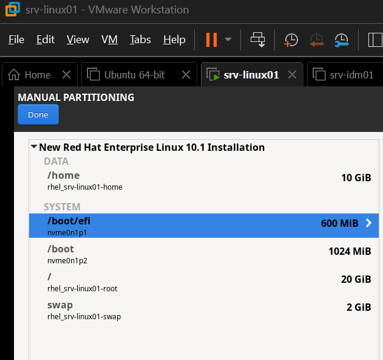
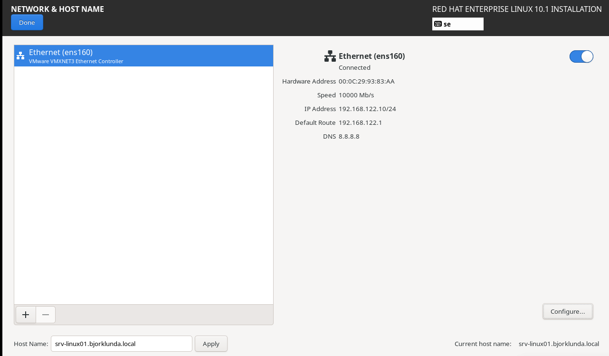

Del 3.3
"lsblk" visar min virtuella hårddisk och alla partitioner samt hur de hänger ihop.

"df -h" visar att mina filsystem är korrekt monterade och hur mycket diskutrymme som används och är ledigt på mina partitioner.

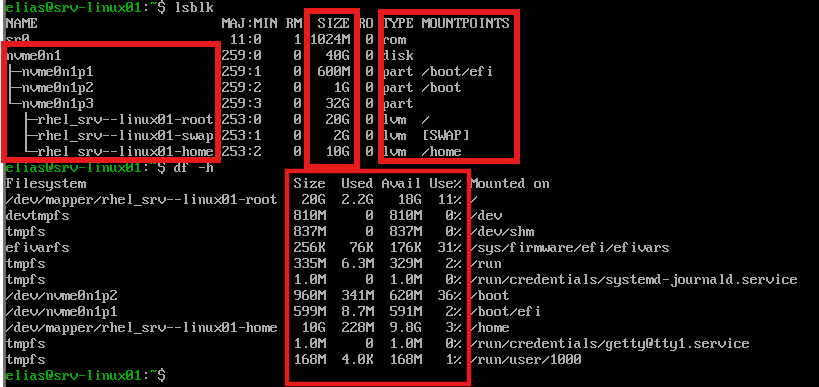

"ip addr show" visar nätverkskonfiguration, exempelvis IP address och nätverkskort.

"hostnamectl" visar vad datorn heter, information om operativsystem och allmän information om datorn som inte riktigt syns så bra för mig då det är en VM och inte en riktig fysisk dator.

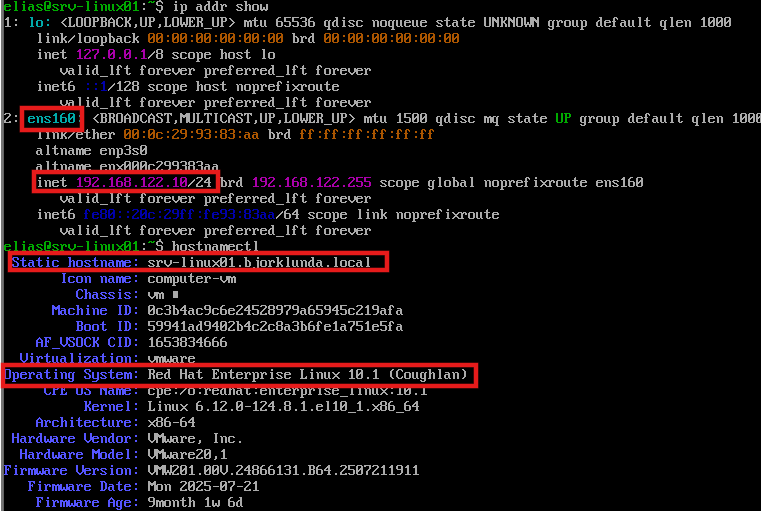

Del 3.4

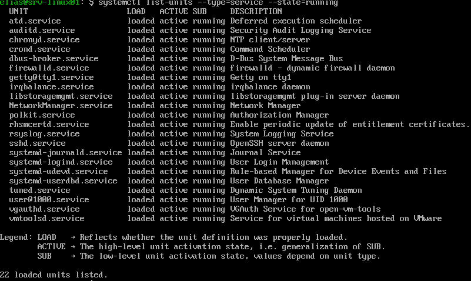

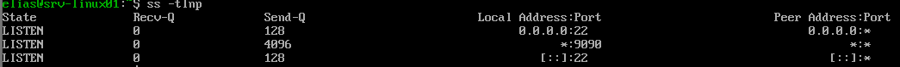

Del 3.4.3.
Tre tjänster och varför de behövs:
"sshd.service" gör att man kan fjärransluta till en server.

"NetworkManager.service" hanterar nätverksanslutningar, utan den fungerar inte internet eller lan.

"firewalld.service" hanterar brandväggen och öppnar och stänger portar för inkommande ut och utgående trafik.

Vilken port lyssnar SSH på och vad används den till?
- Port 22 och används till att fjärransluta.

Om man stänger av en kritiskt tjänst så kan systemet bli ostabilt eller osäkert, beroende på vilken tjänst man stänger av.

Man kan ta reda på om en tjänst är systemkritisk genom att skriva systemctl status <tjänst>

Del 3.5.1

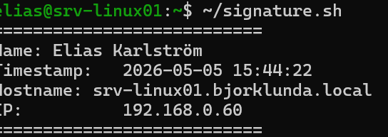
 
 # Felsökning
 del 3.6.1
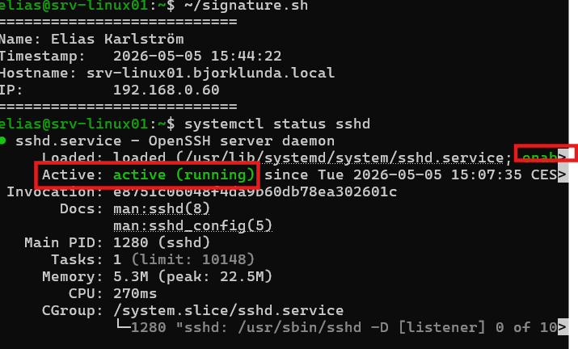
Min output visar att SSH är active (running) och enabled
hade den inte vart igång hade stått stått active (dead) eller inactive (stopped)
För att starta igen hade jag skrivit sudo systemctl start sshd

del 3.6.2
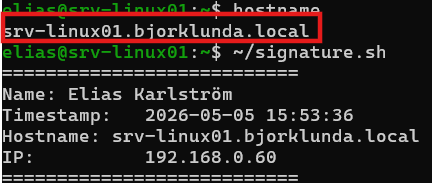
min output visar att mitt datornamn är satt korrekt, detta är vad servern identifierar sig som i nätverket.
Om det skulle stå ett annat namn än vad jag satt så hade det varit fel.
För att byta hostname skriver man sudo hostnamectl set-hostname srv-linux01.bjorklunda.local

Del 3.6.3
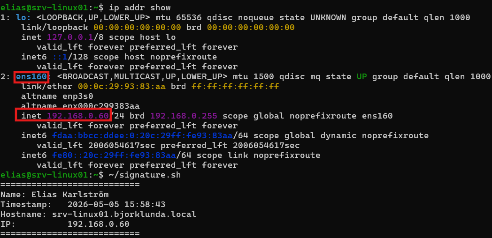
Detta visar att min statiska IP adress som jag har satt på mitt primära nätverkskort är rätt och att den är på samma nätverk som min värddator, då min värddator har samma nätverksadress (det står inte där men jag vet det då jag har kollat det i terminalen med ipconfig)
Hade nätverksadressen varit annorlunda hade den varit på fel nätverk.

Min ip adress var från början fel och då ändrade jag den med "sudo nano /etc/NetworkManager/system-connections/ens160.nmconnection
sudo systemctl restart NetworkManager"

Del 3.6.4
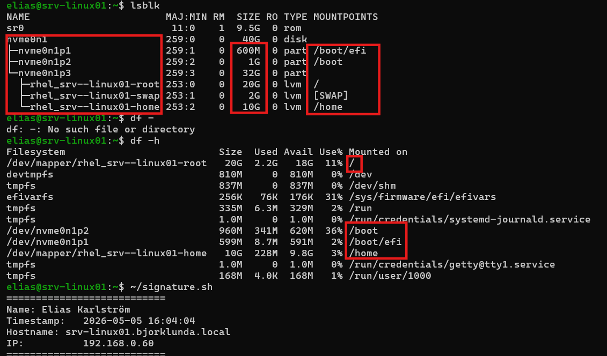

Alla partitioner som jag skapade själv matchar min plan och är på rätt plats med rätt storlek.
Om exempelvis /home had saknats eller om en storlek inte var det jag satte den till, så hade det varit fel.
Man kan korrigera detta här /etc/fstab och sedan ladda om konfigurationen med sudo mount -a

del 3.6.5
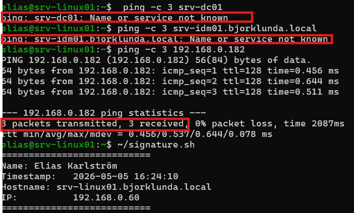
Eftersom jag inte har installerat idm01 och dc01 så kommer ping inte att fungera, vilket framgår i min screenshot. Jag kan dock pinga min värddator.

Nätverksanslutningen hade varit bruten mm ping visar “Destination Host Unreachable”, 100% packet loss även om ip-adresserna är  i samma nät.

Jag hade kontrollerat brandväggar, att alla ip adresser är korrekta och att alla servrar är igång.

# Del 4 — Windows Server och Active Directory -

Del 4.1.1.
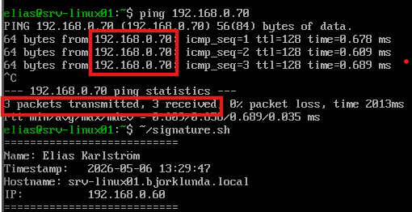
(jag har lyckats pinga till dc01 som har ip 192.168.0.70)

Del 4.1.2
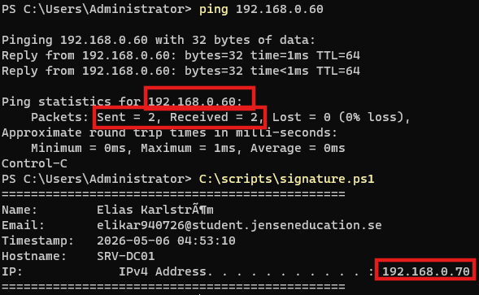
Lyckad ping från DC01 till serv-linux01

Del 4.2
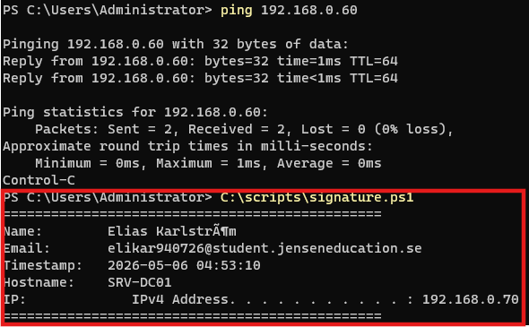
Signatur

Del 4.3.1
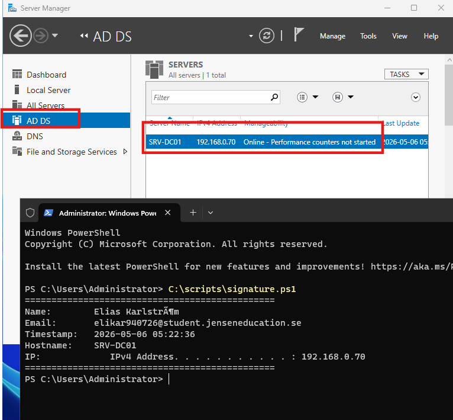
AD DC aktivt

Del 4.3.2 frågor
Vad är en skog(forest) i AD?
En forest är den översta nivån i active directory där alla domäner ingår.

Vad är skillnaden mellan en domän och en OU?
En domän är hela "byggnaden" där alla användare, datorer och regler finns.
OU är där en mapp inne i domänen där man sorterar exempelvis användare och datorer

Vad används DSRM lösenordet till?
Det används när man startar en domänkontrollant i reparationsläge. Det är enda sättet att komma åt AD om databasen går sönder.

Del 4.4.1
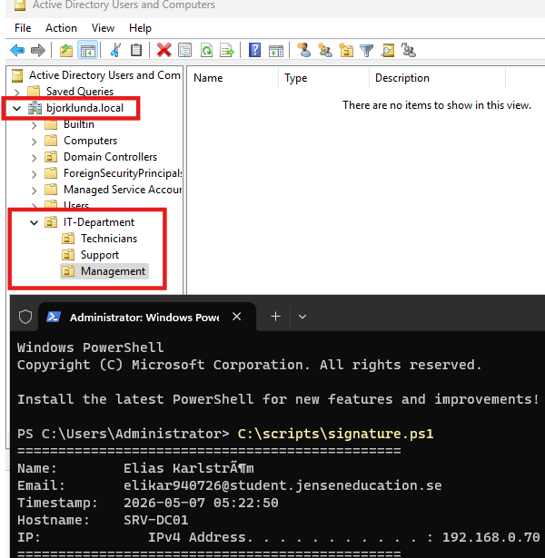

Del 4.5
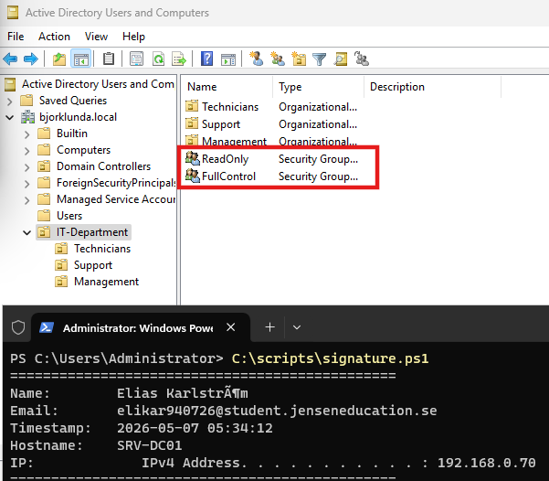
Jag har även skapat grupper direkt under mina tre OU, exempelvis IT-Technicians

Del 4.6.1
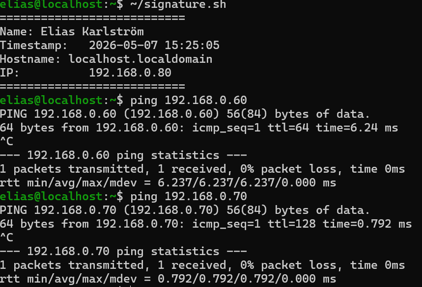

del 4.7.1
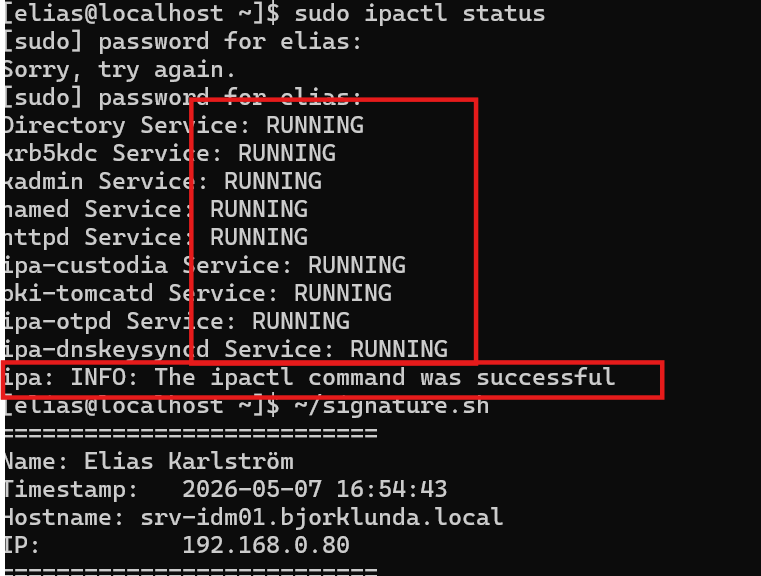
Jag var tvungen att ta bort min VM för att serverdelarna fungerade inte med rhel 10.1
Laddade ner rhel 9.7

Del 4.7.2
1. Vad är RHEL IdM och vad används det till?
RHEL IdM är Red Hats system för central hantering av Linux‑användare, grupper och autentisering. Liknande Active Directory på Windows

2. Skillnaden mellan RHEL IdM och Active Directory i din miljö
IdM hanterar Linux‑konton.
AD hanterar Windows‑konton.

3. Vilka tjänster startar IdM automatiskt och vad gör de?
LDAP – lagrar användare och grupper
Kerberos – sköter inloggning/SSO
Dogtag CA – hanterar certifikat
DNS – domänens DNS
HTTPD – webgränssnittet för IdM

Del 4.8.1
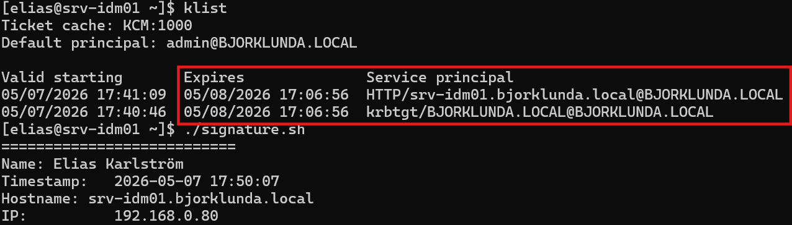

Del 4.8.2
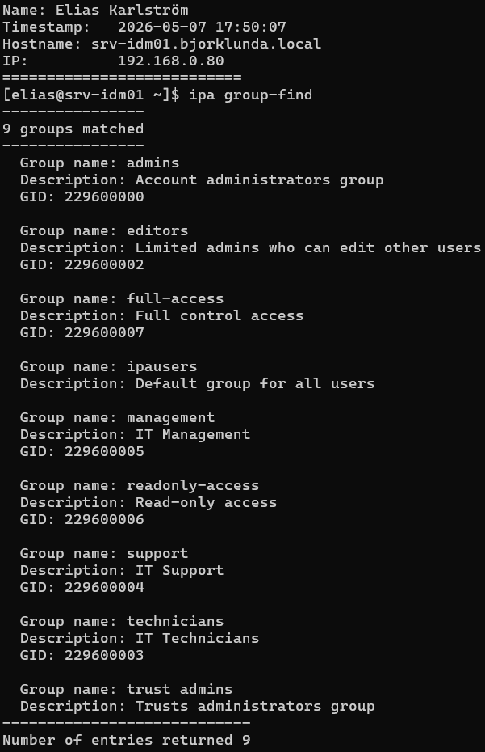

Del 4.9.1
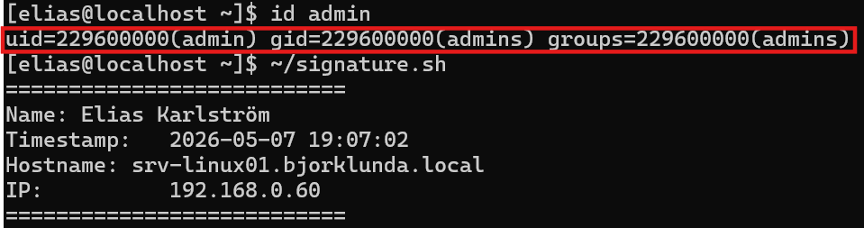

Del 4.9.2 – Svar på frågor
1. Vad innebär det att srv-linux01 är ansluten till IdM?  
Linux01 använder nu centrala IdM‑konton för autentisering istället för lokala konton. På samma sätt som Active Directory fungerar i Windows miljö.

2. Vad är skillnaden mellan att logga in med ett lokalt konto och ett IdM‑konto?  
Lokala konton finns bara loktalt på ens fysiska dator, medan IdM‑konton lagras centralt och fungerar på alla anslutna Linux‑servrar.

3. Vad händer om srv-idm01 slutar fungera?  
Användare som loggat in tidigare kan fortfarande logga in tack vare cache, men nya inloggningar fungerar inte.

# Del 5 — Kontohantering med script -
# Del 6 — Delade mappar och rättigheter -
# Del 7 — Utskriftssystem -
# Del 8 — Virtualisering -
# Del 9 — Lagar och säkerhet -
# Del 10 — Råd och stöd -
# Del 11 — Reflektera över din miljö 